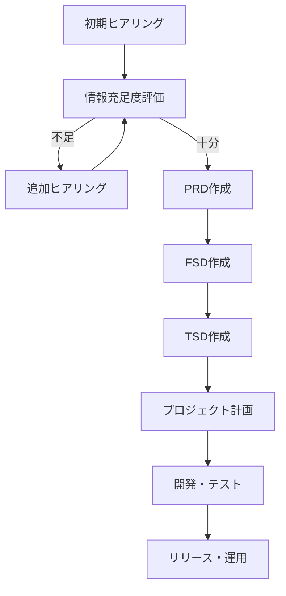

# BOPIS機能（Lou & Kai）資料集

**作成日**: 2025/05/27
**作成者**: PdMチーム
**バージョン**: 0.3（情報充足度再評価）

> 注意: この資料集は初期ドラフトであり、情報充足度チェックリストの結果「要再ヒアリング（50%未満）」に基づいています。
> 多くの情報が不足しているため、追加ヒアリング後に更新が必要です。
> 不足している情報は「要確認」または「TBD」と明記しています。

## 📋 概要

このリポジトリには、BOPIS（Buy Online, Pick up In Store）機能の開発に関する資料が含まれています。これらの資料は、Lousanje Ramirez Navarro氏と甲斐氏のヒアリングシートに基づいて作成されました。

BOPIS機能は、ユーザーが自宅やモバイルデバイスから商品を購入し、後日店舗で効率的に受け取れるようにすることで、配送料の支払いや配達の手配を避けることができるようにするものです。特に、電波が不安定な環境下でも確実に受け渡し処理を完了できる仕組みや、来場者5万〜6万人規模のイベントにおいて大量の受け渡し処理を円滑に行える体制（並列処理）、同時処理中の誤受け渡し（二重渡し等）を防止するための仕組みが必要とされています。

## 📁 資料一覧

### 1. 要件定義フェーズ

- [[必須項目ヒアリング_BOPIS_Lou]] - 初期ヒアリングの内容
- [[情報充足度チェックリスト_BOPIS_Lou]] - 収集した情報の充足度評価
- [[追加質問リスト_BOPIS_Lou]] - 追加ヒアリングのための質問リスト

### 2. 設計フェーズ

- [[PRD_BOPIS_Lou]] - プロダクト要件定義書
- [[FSD_BOPIS_Lou]] - 機能仕様書
- [[TSD_BOPIS_Lou]] - 技術仕様書

### 3. 開発管理フェーズ

- [[プロジェクト管理_BOPIS_Lou]] - プロジェクト計画
- [[JIRAカード例_BOPIS_Lou]] - JIRAカードの例

### 4. テスト・QAフェーズ

- [[テストケース_BOPIS_Lou]] - テストケース仕様書
- [[デバッグシート_BOPIS_Lou_BUG-001]] - 不具合報告書

## 🔄 ワークフロー

このプロジェクトは、以下のワークフローに沿って進行します：



## 📊 情報充足度評価

現在の情報充足度評価は以下の通りです：

| セクション | 評価点 | パーセンテージ |
|------------|--------|----------------|
| 1. プロダクト定義の明確さ | 2.13 | 70.8% |
| 2. ターゲットユーザーの具体性 | 0.88 | 29.2% |
| 3. 機能要件の詳細度 | 0.57 | 19.0% |
| 4. 非機能要件の網羅性 | 0.88 | 29.2% |
| 5. 制約条件の明確さ | 1.63 | 54.2% |
| 6. 成功指標の測定可能性 | 1.0 | 33.3% |
| **総合** | **1.18** | **39.3%** |

**総合判定**: 要再ヒアリング（50%未満）

## 📝 優先的に収集すべき不足情報

以下の情報は優先的に収集する必要があります（情報充足度の低さと重要度を考慮した優先順位）：

1. **機能要件の詳細**
   - 充足度: 19.0%（最低）
   - 重要度: 高
   - 収集方法: 追加ヒアリング
   - 確認先: Lou、Kai、プロダクトオーナー

2. **非機能要件（特にオフライン対応の詳細）**
   - 充足度: 29.2%
   - 重要度: 高
   - 収集方法: 追加ヒアリング、技術検証
   - 確認先: Lou、Kai、技術担当者

3. **ターゲットユーザーの詳細**
   - 充足度: 29.2%
   - 重要度: 高
   - 収集方法: 追加ヒアリング、ユーザー調査
   - 確認先: Lou、Kai、マーケティング担当者

4. **成功指標の具体的な数値目標**
   - 充足度: 33.3%
   - 重要度: 中
   - 収集方法: 追加ヒアリング
   - 確認先: Lou、Kai、ビジネス担当者

5. **制約条件の詳細（特に法的・規制制約）**
   - 充足度: 54.2%
   - 重要度: 中
   - 収集方法: 追加ヒアリング
   - 確認先: Lou、Kai、プロジェクト管理者

## 📋 次のステップ

- [ ] 追加質問リストを使用して追加ヒアリングを実施（上記の優先順位に従って）
- [ ] 情報充足度を再評価
- [ ] 資料を更新
- [ ] 開発チームとのキックオフミーティングを実施
- [ ] 技術検証を開始

## 🧪 テスト実行方法

### E2Eテスト実行

BOPIS_Louプロジェクトでは、包括的なE2Eテストスイートが実装されています。

#### 前提条件

1. **Python環境**: Python 3.8以上
2. **依存関係**: requirements.txtに記載されたパッケージ
3. **データベース**: PostgreSQL（Docker環境推奨）
4. **テストフレームワーク**: pytest + pytest-asyncio + httpx

#### テスト実行手順

```bash
# 1. プロジェクトディレクトリに移動
cd Troop/BOPIS_Lou

# 2. 依存関係のインストール
pip install -r requirements.txt

# 3. E2Eテストの実行
python -m pytest tests/e2e/ -v --tb=short

# 4. 特定のテストファイルの実行
python -m pytest tests/e2e/test_customer_bopis_workflow_api.py -v

# 5. 全テストの実行（警告を抑制）
python -m pytest tests/ -v --disable-warnings
```

#### テスト環境設定

プロジェクトには`pytest.ini`が設定されており、以下の機能が有効化されています：

- **asyncio_mode**: 自動（非同期テストの自動検出）
- **警告フィルター**: 非推奨警告の抑制
- **テストマーカー**: e2e, unit, integration テストの分類

#### テスト構成

| テストファイル | テスト数 | 内容 |
|---------------|---------|------|
| `test_customer_bopis_workflow_api.py` | 1 | 顧客BOPIS完全ワークフロー |
| `test_super_admin_api.py` | 2 | スーパー管理者機能 |
| `test_tenant_admin_api.py` | 2 | テナント管理者機能 |

#### 最新テスト結果

- **成功率**: 100% (5/5テスト成功)
- **実行時間**: 約3.55秒
- **最終実行日**: 2025年6月3日

詳細なテスト結果は [`E2E_TEST_EXECUTION_REPORT.md`](./E2E_TEST_EXECUTION_REPORT.md) を参照してください。

### Docker環境でのテスト

```bash
# Docker環境でのアプリケーション起動
docker-compose up --build app

# 別ターミナルでテスト実行
python -m pytest tests/e2e/ -v
```

## 📝 更新履歴

- **2025/06/03**: v0.4
  - E2Eテスト実行方法を追加
  - テスト環境の要件と手順を明記
  - pytest設定の最適化完了
  - Pydantic v2、SQLAlchemy 2.0対応完了

- **2025/05/27**: v0.3
  - 甲斐氏のヒアリングシートの情報を反映
  - 情報充足度の再評価結果を反映（総合: 26.7% → 39.3%）
  - プロジェクト名を「BOPIS機能（Lou & Kai）」に更新

- **2025/05/27**: v0.2
  - 優先的に収集すべき不足情報の順序を、情報充足度の低さと重要度を考慮して更新

- **2025/05/27**: v0.1
  - 初期ドラフト作成

---

**タグ**: #BOPIS #要件定義 #プロジェクト管理 #PdMテンプレート #E2Eテスト #2025-06